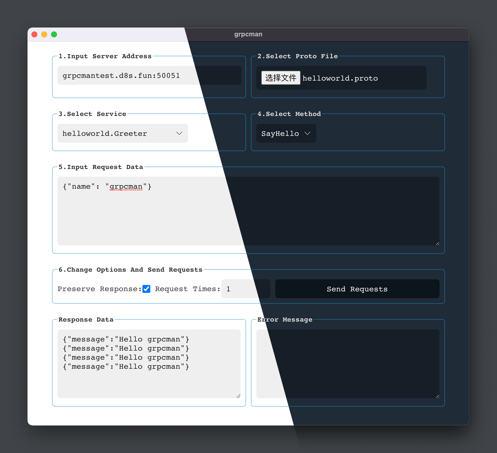

## Screenshot



## Init

```bash
npm install
```

## Run

```bash
npm run electron:start
```

## Package

```bash
npm run make
```

## License

[MIT License](https://choosealicense.com/licenses/mit)
