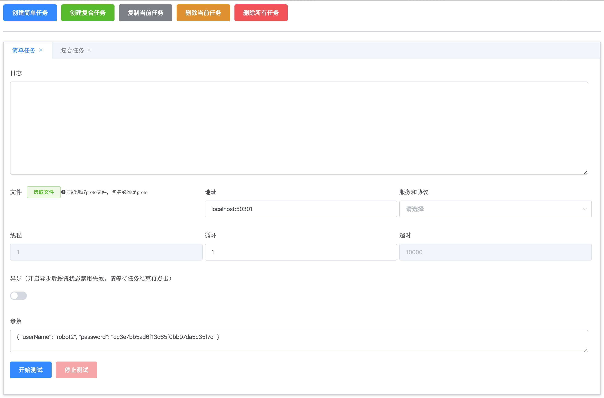

# grpcman

grpc 测试工具



## 项目初始化

```bash
npm install
```

## 项目启动

```bash
npm run electron:serve
```

## 项目编译

```bash
npm run electron:build
```


[本项目由 JetBrains 赞助，使用优秀的前端开发工具 Webstorm 开发 ](https://www.jetbrains.com/?from=grpcman)
